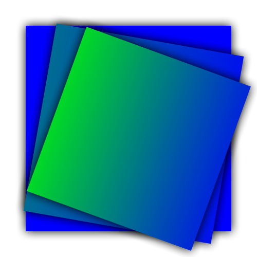

# Presio Backgrounds

A small image generator written in GOLANG.



# Quickstart local development

- Rename `env.localhost` file to be picked up by docker compose. It has defaults values for local development

```bash
mv ./.env.localhost ./.env
```

- Start all containers via `docker compose`

```bash
docker compose up -d
```

- Generate an image using a post request with one of the `_exemples` body

```bash
curl -X POST 'http://localhost:4444/image'
   -H 'Content-Type: application/json'
   -d '${the_json_body}'
```

- Profit from your generated base 64 image !

_Note:_ Access to the db is possible from localhost, as the port is exposed on the host machine?

# TODOs

- Avoid init one connection per API call...
- Optimize use of drawing layers to save GC time
